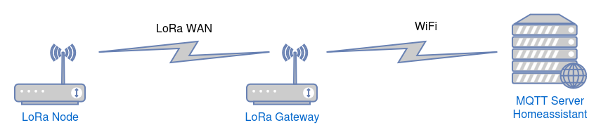
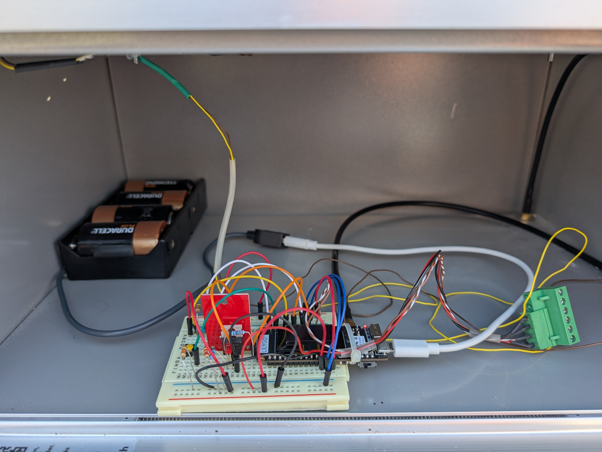
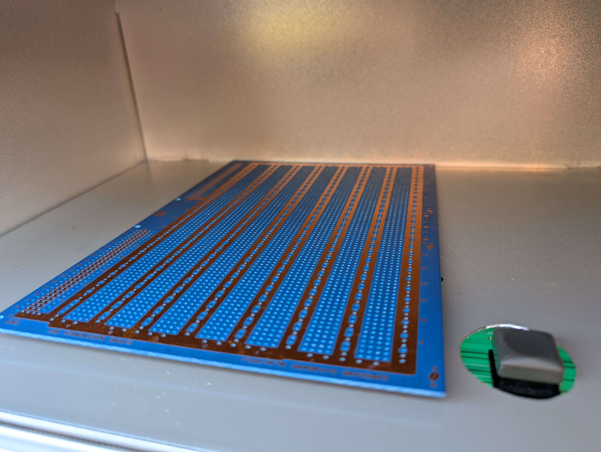
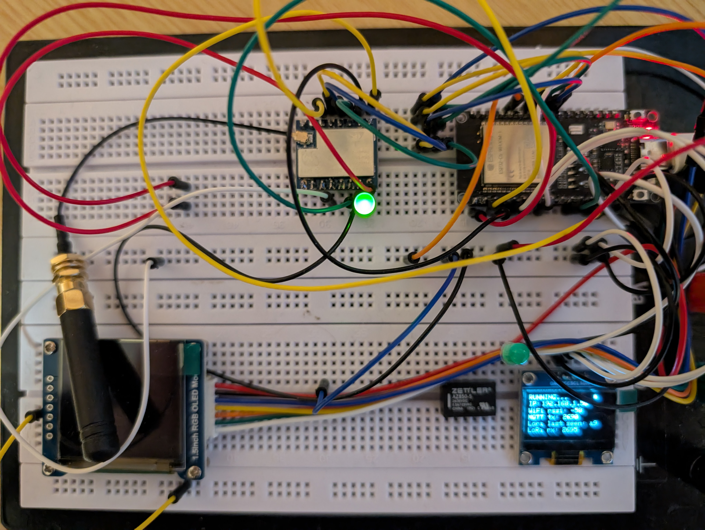

# SBbM - Smarter Briefkasten belegt Melder 

Smarter Briefkasten belegt Melder für Distanzen ausserhalb des WLAN Bereichs mit Hilfe von LoRaWAN (Long Range WAN) Kommunikation zwischen Node (sender) und Gateway (empfaenger)

 

Die LoRa Node(s) senden periodisch (15min) encrypted Messages zum Gateway 
Das LoRa Gateway empfängt Messages von LoRa Nodes, decrypt die Messages und sendet den JSON String mit Hilfte von WiFi zum MQTT Server 
Der MQTT Server kann in Homeassistant integiert werden 

 

Featues

- LoRa Node based on TTGO LoRa32 OLED
- LoRa Node based on TTGO LoRa32 OLED running with Micropython
- LoRa Gateway based on ESP32-C6-N8 and SX1262
- RadioLib for LoRa communication
- Mbedtls for encrypt (AES) messages between node and gateway

 

## Node

Der Node besteht aus dem TTGO LoRa32 OLED und einer Batteriebox

Der Node und die Battriebox wird im/am Briefkasten befestig (Bsp im Milchkäschtli)

Batteriebox: 4 1.5V Mono D

Der Node hat zwei Sensoren
- Drucktaster zum Erkennen das das Biefkastenfach belegt ist
- DHT25 fuer Temperatur Messung (optional)

Jenach Standort Entfernung zum LoRa-Gateway muss die Antenne mit Hilfe einer Verlaengerung nach Aussen gefuerht werden und die LoRa Antenne an der Aussenwand des Breifkasten montiert werden

#### Aufbau 

 

Fuer den Node gibt es zwei Auspraegungen an Code

[Micropython](node-micropython/)

[Arduino Code](node-sketch/)

Beispiel Messages as JSON

Message: "node":"0xA2","msg_num":3557,"temperature":2,"humidity":63,"sensor_value":0,"sensor_state":"false","vbattery":4.393231,"wakeup_reason":4
Message: "node":"0xA2","msg_num":3558,"temperature":2,"humidity":63,"sensor_value":1,"sensor_state":"true","vbattery":4.394562,"wakeup_reason":4

 

## Gateway

Das Gateway besteht aus einem EPS32-C6 8N, einem LoRa SX1262 Module und einem 1.5" OLED

Das Gateway empfängt die Message vom Node, decrypt die Message und sendet die Message an den MQTT Broker

lora/node/a2/events : 
{"ts":1766311521,"ts_string":"2025-12-21T11:05:21+0100","lora_rssi":"-79.00","lora_snr":"12.50","msg_num":5,
 "data":{"node":"0xA2","msg_num":3557,"temperature":2,"humidity":63,"sensor_value":0,"sensor_state":"false","vbattery":4.39323,"wakeup_reason":4}
}

#### Webserver

Der Webserver unterstuetzt nachfolgende Endpoints:

/health
/status
/info

#### Aufbau

Enhanced feature set, with webserver and ...

Hardware: ESP32-C6 8N, SX1262, OLED 1.5"

[Circuit Diagramm](pics/circuit-schema.png)

Fuer das Gateway gibt es eine Auspraegungen an Code

[Arduino Code](sketch-gateway/)

 

## History

Version 2
- LoRa Node(s) based on TTGO LoRa32 OLED
- LoRa Node(s) based on TTGO LoRa32 OLED running with Micropython
- LoRa Gateway based on ESP32-C6-N8 with SX1262
- RadioLib for LoRa communication
- Mbedtls for encrypt (AES) messages between node and gateway

Version 1.5
- LoRa Node(s) based on TTGO LoRa32 OLED
- LoRa Gateway based on ESP32-C6-N8 with SX1262
- Backward supports of V1

Version 1
- LoRa Node(s) based on TTGO LoRa32 OLED
- LoRa Gateway based on TTGO LoRa32 OLED

[Code for Version 1.x](version-1.x/)

 

## Links

### Hardware

[ESP32] (https://www.waveshare.com/wiki/ESP32-C6-DEV-KIT-N8)

[SX1262] (https://www.waveshare.com/core1262-868m.htm)

[OLED]  (https://www.waveshare.com/wiki/1.5inch_RGB_OLED_Module#Introduction)

[TTGO LoRa32] (https://lilygo.cc/products/lora3)

